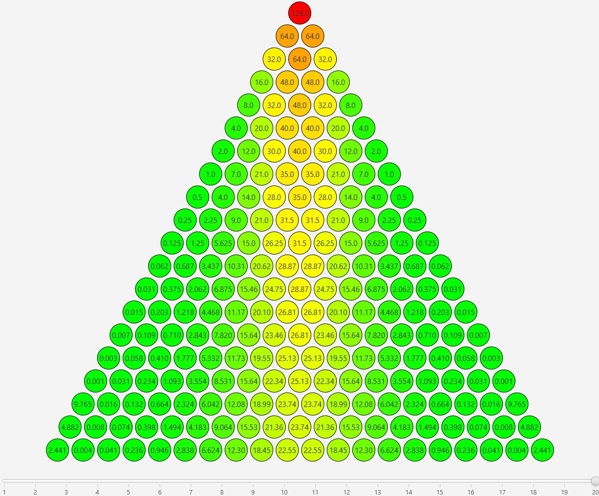

# Node Stacking Demo
An application created for CS401 during the Fall '20 semester at Illinois Institute of Technology, which demonstrates recursion by calculating weight distribution in a 2D pyramid structure of circular nodes. The application _DrawPyramid.java_ draws the pyramid structure using JavaFX, with a slider to select the number of rows to display, and colors the circles a shade of green, yellow or red according to the weight.

### Disclaimer!
_I will not be held accountable if anyone plagiarizes my work! NodeStacking.java contains my solution to lab assignment, but the implementation is fairly trivial if you understand recursion in Java, which you should be able to do on your own if you are following along with the course content._

## Assignment Description
Suppose there’s a structure as follows. Each row of nodes is stacked together to form a
pyramid. Let us consider 128 pounds is the weight on node A, and splits its weight evenly on
the two nodes below it in the pyramid. For example, node A splits its weight across node B
and node C. Node F splits its weight, plus the accumulated weight of the nodes it is
supporting, onto node I and node J.

Suppose this structure has infinite rows. The goal is to design and implement a recursive
method that calculates how much weight a given node is supporting by specifying its row
index and column index. Both indices start from 0, and each row has exact row index + 1
nodes. i.e. A is in row 0, column 0. F is in row 2, column 2. Your method should return -1 if
the input indices are invalid. For example,
- Input 0, 0 which represents A, the output should be 0
- Input 0, 1, which is an invalid index. The output should be -1
- Input 1, 1, which is C. The supported weight should be the half of A’s weight and the weight
it’s carrying. 1/2 * (128 + 0) = 64. Thus, output should be 64.

## Application

